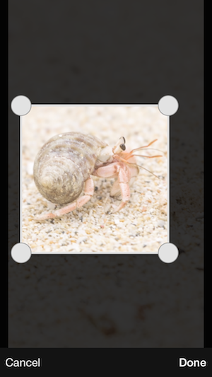

ImageCropSample
===============

画像切り取りのサンプルです



###使い方
1. git clone git@github.com:yoshimin/ImageCropSample.git
2. 自分のプロジェクトに`ImageCropView`ディレクトリ以下をを追加
3. 使用したいクラスで `YMNImageCropViewController.h` をインポート
4. `YMNImageCropViewController`のインスタンスを生成してビューを立ち上げる
5. 切り取った画像はdelegateで呼び元のクラスに返される
```
self.imageCropViewController = [[YMNImageCropViewController alloc] initWithImage:image];
self.imageCropViewController.delegate = self;
[self presentViewController:self.imageCropViewController animated:NO completion:nil];
```
```
- (void)imageCropViewController:(UIViewController* )controller didFinishCroppingImage:(UIImage *)image
{
    //ここでimageを受け取る
}
```

###その他
切り取り用の枠はアスペクト比自由とアスペクト比固定の2パターン
```
/// クロップの枠の拡縮の仕方
typedef NS_ENUM(NSUInteger, YMNImageCropMode) {
    /// 枠のアスペクト比は自由
    YMNImageCropModeFlexible,
    /// 枠のアスペクト比は固定
    YMNImageCropModeFixedAspect
};
```
以下のように指定が可能
```
self.imageCropViewController.cropMode = YMNImageCropModeFixedAspect;
self.imageCropViewController.cropRectAspectRatio = 1.f;
```
